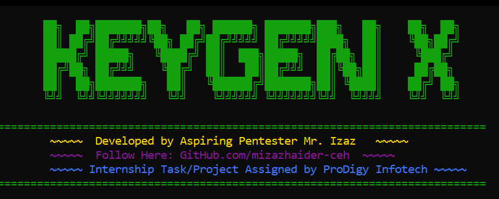
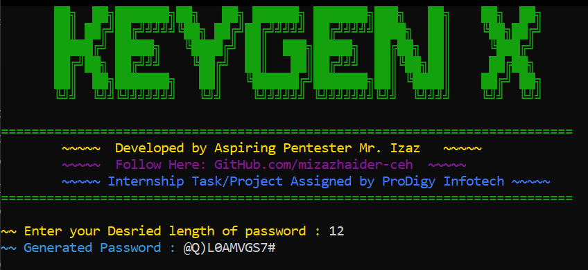
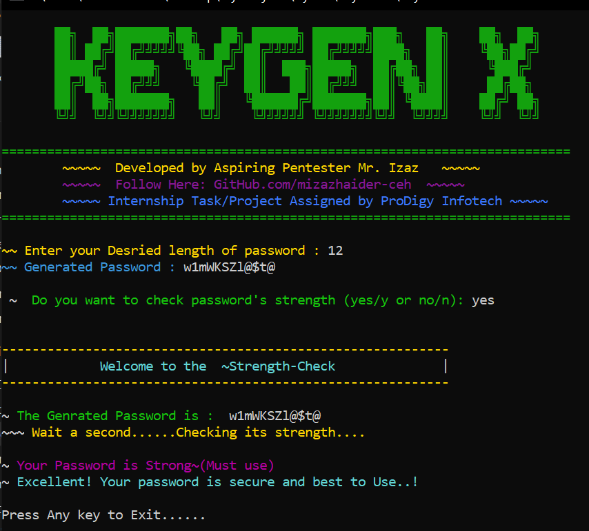

# KeyGen-X - Secure Key Generation Tool 🔑



## **Developed by: Muhammad Izaz Haider**

## 📌 Overview

KeyGen-X is a powerful and lightweight security tool designed for generating and verifying cryptographic keys while also serving as a hybrid password strength analysis tool. Built using a combination of C++ and Python, it ensures efficient and secure key creation while maintaining flexibility.

The C++ script (`KeyGen-X.cpp`) acts as the master, handling execution flow, while the Python script (`keycheck.py`) performs validation and password analysis. KeyGen-X provides an interactive command-line interface (CLI) that evaluates password strength based on security parameters, classifying passwords as Weak, Medium, or Strong.

Designed primarily for Windows, KeyGen-X generates a standalone executable (`KeyGen-X.exe`) after compilation. The same process applies to Linux and macOS, ensuring cross-platform compatibility. With features like color-coded CLI output, fast execution, and strong security measures, KeyGen-X is an essential tool for developers and cybersecurity enthusiasts.

## 🛠 How KeyGen-X Works

KeyGen-X generates and validates cryptographic keys with a focus on security and performance. The process involves:

✔️ Generating a unique key based on predefined security parameters.

✔️ Automatic verification using the Python script (`keycheck.py`).

✔️ Ensuring compatibility across multiple operating systems.

✔️ Providing an efficient and lightweight solution for developers and security researchers.

KeyGen-X analyzes password complexity based on the following factors:
✔️ Length (Minimum 8 characters required)

✔️ Uppercase Letters (At least one uppercase character)

✔️ Lowercase Letters (At least one lowercase character)

✔️ Numbers (At least one digit)

✔️ Special Characters (At least one special symbol)

Each factor contributes to the overall password strength:
🔴 Weak: Password is too simple or too short.

🟡 Medium: Decent but can be improved.

🟢 Strong: Secure and recommended for use.

## 📌 Features

✔️ Secure key generation with robust algorithms

✔️ Automatic validation mechanism

✔️ Cross-platform support (Windows, Linux, macOS)

✔️ Fast and lightweight execution

✔️ Open-source and customizable

✔️ Interactive CLI with color-coded output for better user experience

✔️ Enhanced security measures for stronger key generation

## 📂 Project Structure

```
KeyGen-X/
│── KeyGen-X.cpp         # Main C++ script (Master Script)
│── keycheck.py         # Python script for key validation
│── KeyGen-X.exe        # Compiled executable (Windows)
│── README.md          # Project documentation
│── screenshots/       # Folder containing example screenshots
│   │── logo.png       # Project logo
│   │── working.png    # Example of KeyGen-X in action
│   │── power.png      # Representation of security strength
```

## 🖥 Screenshots

### 🔹 **Project Logo**


### 🔹 **Key Generation in Action**



### 🔹 **Security Strength Representation**


### 🔹 **Complete Showcase of KeyGen-X**



## 🎯 Why I Built This Project

✔️ To enhance my C++ and Python integration skills.

✔️ To explore secure key generation methodologies.

✔️ To create a lightweight and efficient security utility for developers.

✔️ To gain practical experience in cryptographic techniques.

✔️ To contribute to the cybersecurity community with an open-source tool.

As a cybersecurity enthusiast, I wanted to combine C++ and Python to create an interactive password strength analyzer. This project helped me explore cross-language integration and security concepts while improving command-line tool development.

## 📚 What I Learned

✔️ C++ and Python integration (Calling Python scripts from C++)

✔️ Command-line interface (CLI) application development

✔️ Password security principles

✔️ Error handling and input validation

✔️ Creating standalone executables for Windows, Linux, and macOS

✔️ Implementing color-coded CLI output for better user interaction

## 🔹 Usage

1️⃣ Run KeyGen-X and it will generate a password of a predefined length.
2️⃣ The tool will prompt you to check the password strength (Yes/Y to proceed).
3️⃣ KeyGen-X will analyze its strength based on predefined security criteria.
4️⃣ Receive immediate feedback on whether it's:

* 🔴 **Weak** – Password is too simple or too short.
* 🟡 **Medium** – Decent but can be improved.
* 🟢 **Strong** – Secure and recommended for use.

## 🛠 Installation & Usage

### 🔹 Clone the Repository

```sh
git clone https://github.com/mizazhaider-ceh/KeyGen-X.git
cd KeyGen-X
```

### 🔹 Compile the C++ Script

For Windows:

```sh
g++ KeyGen-X.cpp -o KeyGen-X.exe
```

For Linux/macOS:

```sh
g++ KeyGen-X.cpp -o KeyGen-X
chmod +x KeyGen-X
```

### 🔹 Run the Program

On Windows:

```sh
KeyGen-X.exe
```

On Linux/macOS:

```sh
./KeyGen-X
```

## 🏆 The Project Ends... But The Journey Continues!

If you like this project, consider giving it a ⭐ on GitHub!

## 📜 License

This project is open-source and available under the MIT [LICENSE](LICENSE).

## 👨‍💻 Who I Am

I am Muhammad Izaz Haider, a cybersecurity enthusiast and ethical hacker with experience in C++, Python, Bash/Shell, and C. Passionate about security research, I develop tools like KeyGen-X to contribute to the cybersecurity community and enhance security awareness. I want to help the community by building something useful for people, also to check what I can do and how far I can go. Always learning something new, showing my skills, and expanding my knowledge. I am an aspiring penetration tester constantly pushing my limits in cybersecurity.

## 📬 Connect with Me

**GitHub:** [mizazhaider-ceh](https://github.com/mizazhaider-ceh)

**LinkedIn:** [Muhammad Izaz Haider](https://linkedin.com/in/mizazhaider)

**Email:** [mizazhaider@gmail.com](mailto:mizazhaider@gmail.com)
